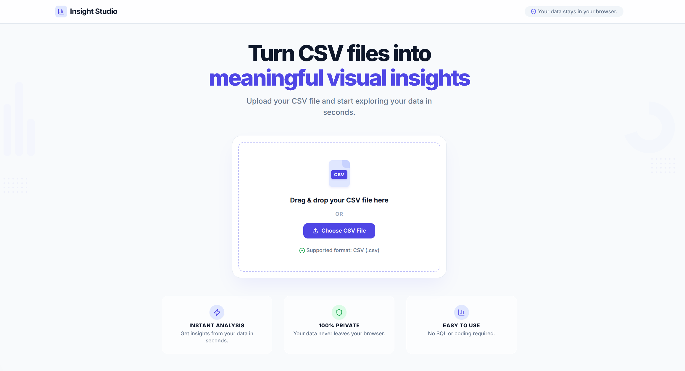
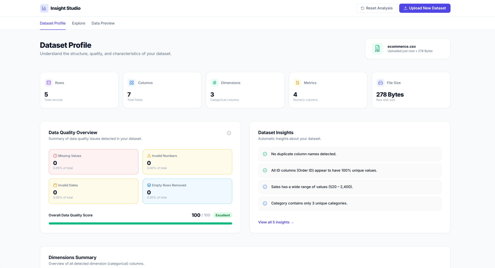
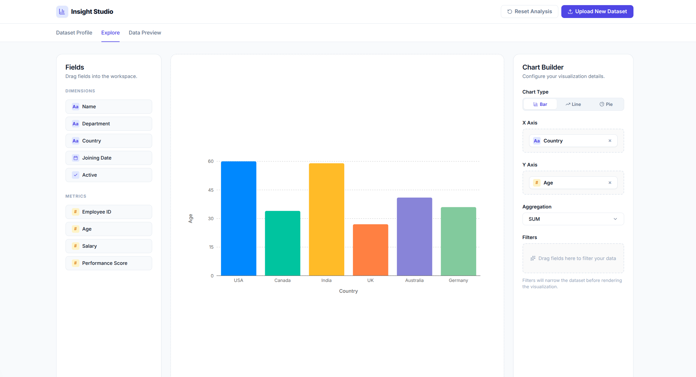
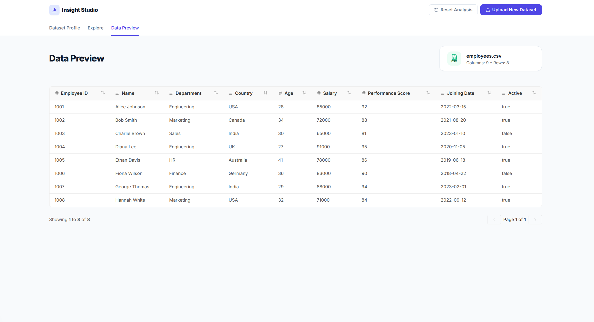

# Self-Service Analytics Tool

A lightweight self-service analytics platform built with Next.js and TypeScript that enables users to upload CSV datasets, automatically profile their data, and create interactive visualizations through an intuitive drag-and-drop interface.

---

## Overview

The application provides a lightweight self-service analytics experience inspired by modern BI tools.

Users can:

- Upload CSV datasets
- Automatically profile uploaded data
- Detect Dimensions and Metrics
- Review dataset quality and statistics
- Build visualizations using drag-and-drop
- Filter data interactively
- Aggregate metrics
- Explore data entirely inside the browser

All data processing is performed client-side, ensuring privacy and fast interaction.

---

## Features

### CSV Upload

- Drag & Drop upload
- File picker support
- CSV validation
- Malformed CSV detection
- Duplicate column detection
- User-friendly validation messages

---

### Dataset Profile

Automatically analyzes uploaded datasets and displays:

- Total Rows
- Total Columns
- Dataset Size
- Number of Dimensions
- Number of Metrics
- Missing Values Summary
- Metrics Summary
- Dimensions Summary
- Data Quality Overview

---

### Explore Workspace

Interactive chart builder supporting:

- Drag & Drop fields
- Dynamic chart updates
- Interactive filters
- Automatic aggregation

Supported Charts

- Bar Chart
- Line Chart
- Pie Chart

Supported Aggregations

- SUM
- AVG
- COUNT
- MIN
- MAX

---

### Filters

Different filter controls are automatically selected based on the field type.

**Dimensions**

- Multi-select checkbox filters

**Metrics**

- Minimum value
- Maximum value

**Dates**

- Start Date
- End Date

---

## Screenshots

### Landing Page



### Dataset Profile



### Explore Workspace



### Dataset Preview



---

## Tech Stack

### Frontend

- Next.js (App Router)
- React
- TypeScript
- SCSS Modules

### State Management

- Zustand

### Charts

- Recharts

### Drag & Drop

- dnd-kit

### CSV Parsing

- PapaParse

### UI

- Lucide React
- Framer Motion

---

## Project Structure

```text
src/
│
├── app/                     # Application routes
│   ├── page.tsx             # Landing page (CSV Upload)
│   ├── insights/            # Dataset insights overview
│   └── studio/              # Dataset profile & analytics workspace
│
├── components/              # Reusable UI and feature components
│
├── features/                # CSV parsing, validation and analytics
│
├── store/                   # Zustand stores
│
├── types/                   # Shared TypeScript types
│
├── hooks/                   # Custom React hooks
│
├── utils/                   # Utility functions
│
└── styles/                  # Global styles
```

---

## Application Flow

```text
CSV Upload
      │
      ▼
CSV Validation
      │
      ▼
Dataset Profiling
      │
      ▼
Dataset Store
      │
      ├──────────────► Dataset Profile
      │
      └──────────────► Explore Workspace
                           │
                           ▼
                     Apply Filters
                           │
                           ▼
                     Aggregate Data
                           │
                           ▼
                     Render Charts
```

---

## Getting Started

### Prerequisites

- Node.js 18+
- npm

### Install

```bash
npm install
```

### Development

```bash
npm run dev
```

Open:

```
http://localhost:3000
```

### Production

```bash
npm run build
npm run start
```

---

## Current Scope

The current implementation focuses on delivering a complete end-to-end analytics workflow.

Future enhancements may include:

- Group By
- Additional chart types
- Dashboard saving
- Export functionality
- Virtualized tables
- Large dataset optimization
- AI-assisted insights

---

This project was created for educational and portfolio purposes.